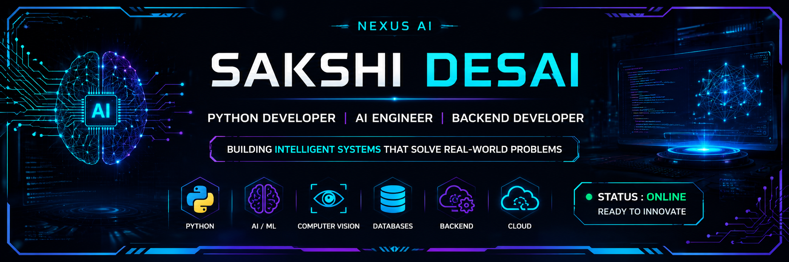

<p align="center">
  
</p>

<div align="center">

# 🧠 NEXUS AI

## Sakshi Desai

### Python Developer • AI Engineer • Backend Developer

**Building intelligent software with Python, AI, Computer Vision & Backend Engineering.**

<p>

</p>

<p>


</p>

</div>

---

## 🚀 Navigation

<p align="center">

<a href="#-system-status">System</a> •
<a href="#-mission-brief">Mission</a> •
<a href="#-tech-arsenal">Tech Stack</a> •
<a href="#-active-projects">Projects</a> •
<a href="#-github-dashboard">Analytics</a> •
<a href="#-learning-dashboard">Learning</a> •
<a href="#-communication-hub">Contact</a>

</p>

---

# ⚡ System Status

```text
╔══════════════════════════════════════════════╗

        NEXUS AI INITIALIZED

 Python Engine .............. 🟢 ONLINE

 AI Modules ................. 🟢 ACTIVE

 Backend Services ........... 🟢 RUNNING

 Computer Vision ............ 🟢 READY

 GitHub Sync ................ 🟢 COMPLETE

 Learning Mode .............. 🟢 ENABLED

═══════════════════════════════════════════════

 Welcome to my AI Workspace

╚══════════════════════════════════════════════╝
```

---

# 🚀 Mission Brief

I enjoy building intelligent software by combining:

- 🐍 Python
- 🤖 Artificial Intelligence
- 👁 Computer Vision
- ⚙ Backend Development
- 🗄 SQL Databases

My goal is to build scalable applications that solve real-world problems through clean architecture and practical AI.

---

# ⚙ Tech Arsenal

<div align="center">


</div>

| Area | Technologies |
|------|--------------|
| Programming | Python, SQL |
| Backend | FastAPI, Flask, REST APIs |
| AI | OpenCV, YOLO, NumPy, Pandas |
| Database | MySQL, SQLite, MongoDB |
| Tools | Git, GitHub, VS Code |
| Learning | Docker, AWS, Machine Learning |

---

# 🚀 Active Projects

## 🛰 AI Surveillance System

> Real-time surveillance platform using Python, OpenCV and YOLO.

### Highlights

- Object Detection
- Motion Detection
- Smart Alerts
- Real-Time Processing

---

## 🎓 Exam Proctor AI

> AI-powered examination monitoring system.

### Highlights

- Face Detection
- Object Detection
- Live Dashboard
- Flask Backend

---

## 🛒 QuickPick

> Smart Grocery Management System.

### Highlights

- Billing
- Inventory
- Voice Commands
- SQLite Database

---

# 📊 GitHub Dashboard

<div align="center">


</div>

<div align="center">


</div>


</div>

<br>

<div align="center">

</div>


# 🌱 Learning Dashboard

```text
Python               ████████████████████

SQL                  ██████████████████

FastAPI              ███████████████

Machine Learning     ██████████

Docker               ███████

AWS                  █████
```

---

# 🎯 Current Objectives

- ✅ Build Production AI Applications
- ✅ Master FastAPI
- ✅ Learn Docker
- ✅ Learn AWS
- ✅ Improve System Design
- ✅ Contribute to Open Source
- 🎯 Become a Software Engineer

---

# 📡 Communication Hub

<div align="center">

<a href="https://github.com/SakshiDesai123">
GitHub
</a>

•

<a href="linkedin.com/in/sakshi-desai-738373260 ">
LinkedIn
</a>

•

<a href="mailto:sakshidesai0509@gmail.com">
Email
</a>

</div>

---

<div align="center">

### 💭 AI Philosophy

> *"Every intelligent system starts with one line of code."*

<br>


</div>
